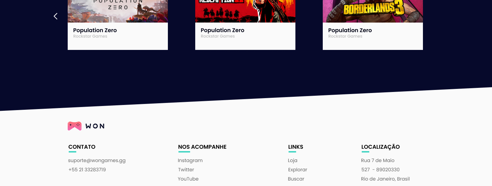
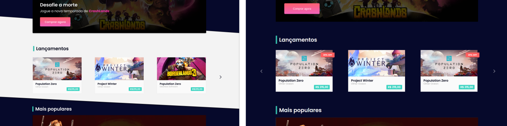

# WON Games 🎮


Projeto para avaliar os meus conhecimentos e a minha prática de código.

## Sobre o projeto

WON é parte do curso de React Avançado do Willian Justen. Saiba mais clicando [aqui](https://reactavancado.com.br/).

## Desafios

Durante as dúvidas tentei pesquisar em conteúdos que não fizessem referência ao projeto do curso em si, assim poderia manter um viés mais pessoal sobre como eu resolveria os problemas.

### Alguns insights:

1. Importei imagens e criei objetos de maneira *hard-coded*, já que não há uma API para consumir. Se houvesse uma API, uma alterantiva para renderizar os resultados seria algo no estilo:

```
// carregar os dados no primeiro render do componente e passar para o estado:

import { useEffect, useState } from 'react'
import axios from 'axios'

...

const [data, setData] = useState([])
const getData = async () => await axios.get().(data => setData(data))

useEffect(() => {
  getData()
}, [])

```

2. Criar divs com formatos angulosos foi algo novo. Consegui um resultado próximo usando `clip-path: polygon(...)` do CSS:



Possivelmente eu conseguiria o mesmo resultado na área de cima, mas para isso eu tenho que refazer o container por conta das margens que não deixam os cantos da div não encostar nas laterais.



3. Usei a lib [Splide.js](https://splidejs.com/integration-react-splide/) para montar os sliders, mas não consegui deixar os elementos clicáveis, seja por CSS ou utilizando a prórpia tag `<a>`.

4. Alterei o favicon, mas também há mais oportunidades para mudar o título da página como, por exemplo, usando o `react-helmet` no CRA ou `<Head>` no Next.js.

## Rodando o projeto

Você pode clonar esse repositório e instalar as dependências com `npm i`. Em seguida, rode `npm start` para acessar o projeto em `localhost:3000`